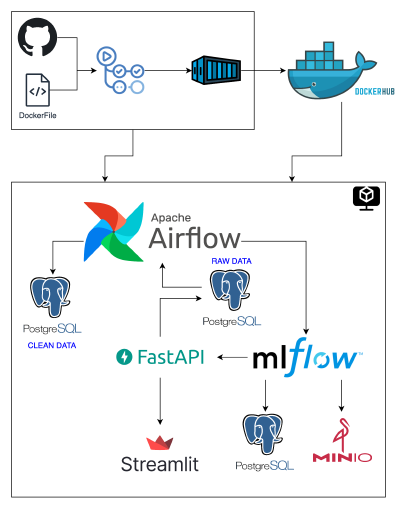
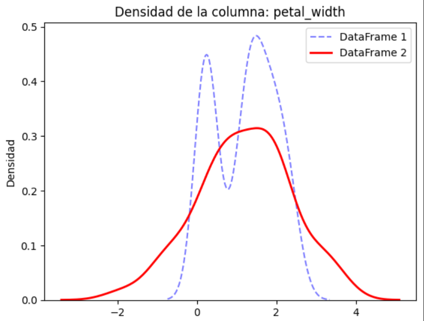

# Project 4 - Grupo 1: Predicción de Precios de vivienda


Class: MLOps <br>
Code: 11179 <br>
Professor: Cristian Diaz Alvarez <br>
Members:

    Daniel Chavarro - @anielFchavarro
    Cristhian Palencia - @cpalenc
    Oscar Correa - @oecorrechag

## Table of Contents

- <a href='#1'>1. Introducción</a>
- <a href='#2'>2. Uso del Proyecto</a>
    - <a href='#2.1'>2.1 Guía de Usuario</a>
    - <a href='#2.2'>2.2 Links de servicios</a>
    - <a href='#2.3'>2.3 Dags</a>
        - <a href='#2.3.1'>2.3.1 Lista de Dags</a>
- <a href='#3'>3. Inferencia</a>
- <a href='#4'>4. Descripción de la Arquitectura</a>
    - <a href='#4.1'>4.1 Diagramas de Arquitectura</a>
- <a href='#5'>5. Test</a>
    - <a href='#5.1'>5.1 Kullback–Leibler divergence</a>
    - <a href='#5.2'>5.2 Kolmogorov-Smirnov test</a>
    - <a href='#5.3'>5.3 Test general </a>

<hr>

## <a id='1'>1. Introducción </a>

**Descripción del Proyecto:** 

Este proyecto emplea un modelo de aprendizaje automático para la predicción de precios en función de parámetros de entrada específicos. La ejecución del código se realiza en diversos contenedores, utilizando Apache Airflow para la orquestación de tareas.

link video: https://www.youtube.com/watch?v=qqPX2ic0lEI

[](https://www.youtube.com/watch?v=qqPX2ic0lEI)


## <a id='2'>2. Uso del Proyecto </a>

### <a id='2.1'>2.1 Guía de Usuario </a> 

Para iniciar los servicios, se requiere la instalación de Docker en su máquina. Una vez instalado, ejecute el siguiente comando en la terminal para construir y levantar el contenedor:

1. Download the repository.

```bash
ssh git clone https://github.com/cpalenc/MLOps.git -d proyecto_4_base
```
2. Navigate to the **proyecto_4_base** branch within the project_4 folder.

```bash
cd MLOps/
git checkout proyecto_1
cd project_4
```
3. Run the following Docker command:

```bash
docker compose up
```

4. Access the links below to find the services described in section 2.2.


### <a id='2.2'>2.2 Links de servicios </a> 

Una vez activados, los servicios estarán disponibles en las siguientes direcciones:

* Airflow: http://localhost:8080
* Mlflow: http://localhost:5000
* Minio: http://localhost:9001
* Jupyer: http://localhost:8888
* Fastapi: http://localhost:8000
* Streamlit: http://localhost:8502

### <a id='2.3'>2.3 Dags </a> 

Para activar los DAGs (Directed Acyclic Graphs) en Apache Airflow, siga estos pasos:

1. Acceda a la interfaz gráfica de Apache Airflow: Abra su navegador web y navegue hasta la dirección http://localhost:8080.
2. Localice la página de DAGs: En la interfaz gráfica, busque la sección o pestaña dedicada a la gestión de DAGs.
3. Identifique los DAGs que desea activar: Revise la lista de DAGs disponibles y seleccione aquellos que desea ejecutar.
4. Active los DAGs seleccionados: Utilice el botón o la opción correspondiente para activar cada DAG seleccionado.

### <a id='2.3.1'>2.3.1 Lista de Dags </a> 

- Ingesta de datos (1.Carga_raw_o_test_data_dag): 

    **Función del DAG**

    Este DAG desempeña dos funciones principales:

    - Recuperación de información base: Realiza una solicitud a la API correspondiente para obtener la información base que se procesará posteriormente.

    - Enrutamiento de datos: En función del valor del parámetro batch_number recibido:

        - Si batch_number es igual a 0, carga los datos en la tabla **raw_data**. <br>
        - Si batch_number es distinto de 0, carga los datos en la tabla **test_data**.


* Limpieza de datos (2.Limpieza_y_carga_a_db2): Este DAG procesa datos de la tabla **raw_data** en la base de datos **database1**, aplicando reglas de limpieza definidas, y los almacena en la tabla **clean_data** en la base de **datos database2**.

* Entrenamiento del modelo (3.Entrenamiento_de_modeloV2): Este DAG se encarga del entrenamiento del modelo y del almacenamiento de la información relevante en mlflow, incluyendo métricas, parámetros, el modelo en sí y artefactos asociados.

* Elección reentrenamiento (4.retrain_data_dag): Este DAG realiza una comparación entre las distribuciones de datos de las tablas **raw_data.database1** y **test_data.database1** en base a criterios predefinidos. A partir de este análisis, determina si es necesario **reentrenar** el modelo con los nuevos datos. En caso de requerirse el reentrenamiento, el DAG copia los datos de la **tabla test_data.database1** a la tabla **raw_data.database1**, los limpia, los almacena en la tabla **clean_data.database2** y, finalmente, reentrena el modelo.


## <a id='3'>3. Inferencia </a>

Para realizar inferencias con el modelo, siga estos pasos:

1. Acceda al servicio Steam: Abra su navegador web y navegue hasta la dirección http://localhost:8502.
2. Introduzca los datos de entrada: En la interfaz del servicio Steam, ingrese los datos necesarios para la inferencia.
3. Obtenga los resultados: El servicio Steam procesará los datos de entrada y le proporcionará los resultados de la inferencia del modelo.

## <a id='4'>4. Descripción de la Arquitectura </a>

### <a id='4.1'>4.1 Diagramas de Arquitectura </a> 



## <a id='5'>5. Test </a>

### <a id='5.1'>5.1 Kullback–Leibler divergence </a> 

Es un tipo de distancia estadística: una medida de cómo una distribución de probabilidad P es diferente de una segunda distribución de probabilidad de referencia Q

Wikipedia. (2024, June 1). Kullback–Leibler divergence. In Wikipedia. https://en.wikipedia.org/wiki/Kullback%E2%80%93Leibler_divergence.

### <a id='5.2'>5.2 Kolmogorov-Smirnov test </a> 

Es una prueba no paramétrica que determina la bondad de ajuste de dos distribuciones de probabilidad entre sí.

Wikipedia. (2024, mayo 31). Prueba de Kolmogorov-Smirnov. Wikipedia la enciclopedia libre.

### <a id='5.3'>5.3 Test general </a> 

Tras calcular y promediar los resultados de los dos tests anteriores, se verifica que el valor promedio sea superior a 0.6. Si se cumple esta condición y, además, el segundo conjunto de datos representa más del 10% del dataset de entrenamiento, se procede a reentrenar el modelo.

Considerando un ejemplo con el dataset Iris y otro dataset con ruido introducido

Metricas:

    - Kullback–Leibler: 0.8
    - Kolmogorov-Smirnov: 0.4
    - Promedio: 0.6
    - Proporcion segundo conjunto de datos: 25%

En este caso, se reentrenaría el modelo, centrándose visualmente en una de las variables, petal width.



<hr>

[Go to Top](#Table-of-Contents)