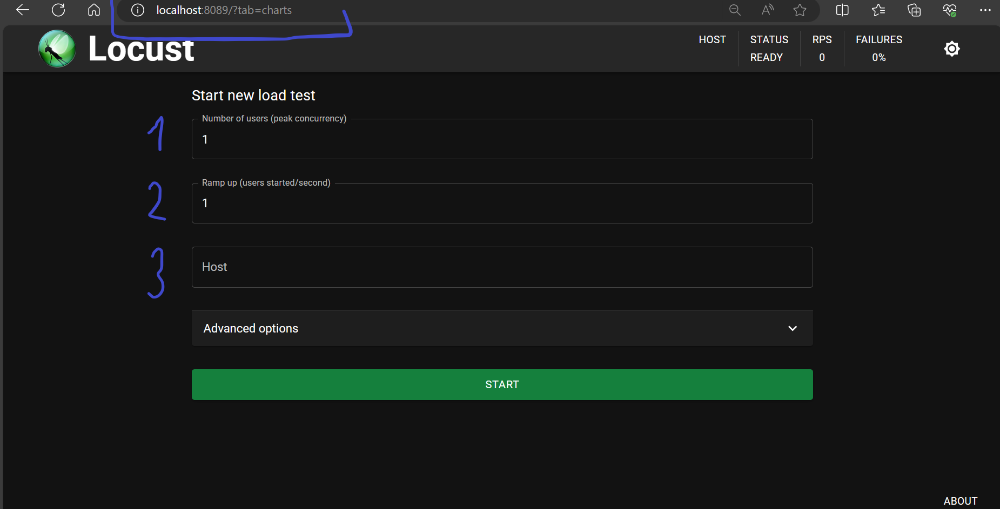
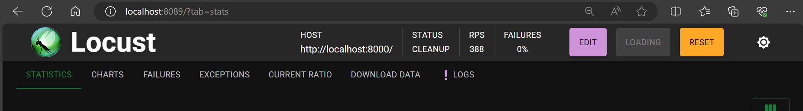
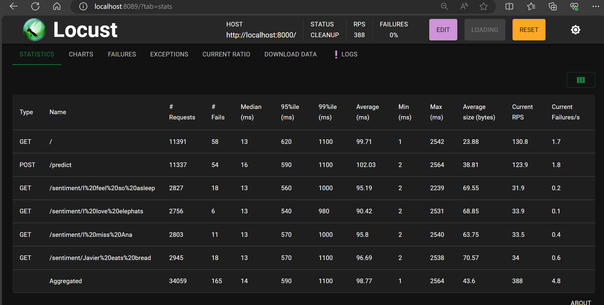
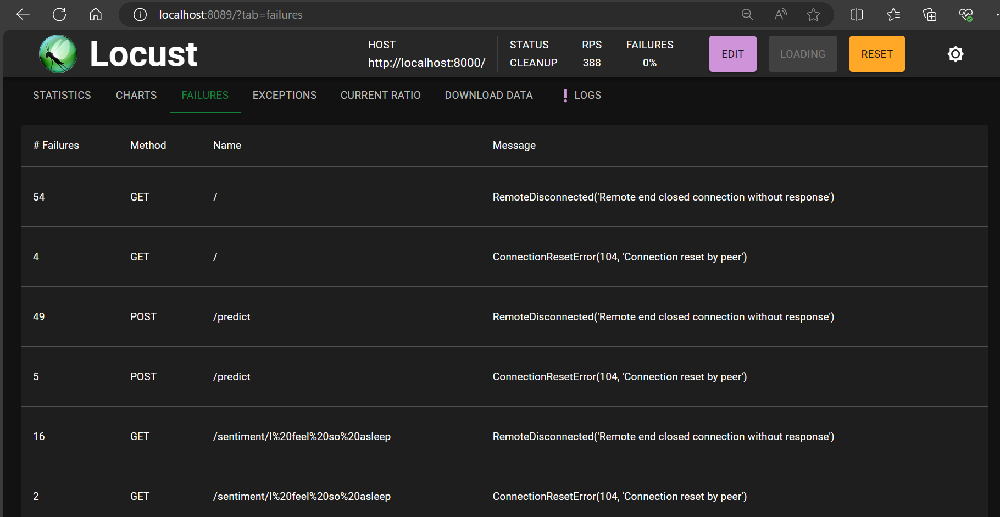
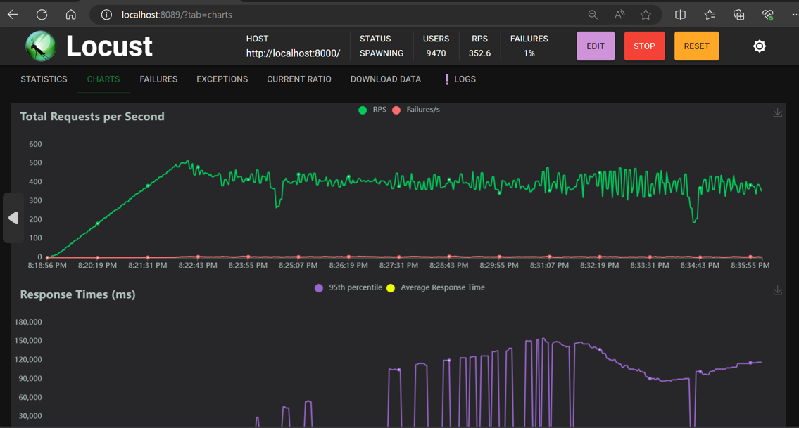
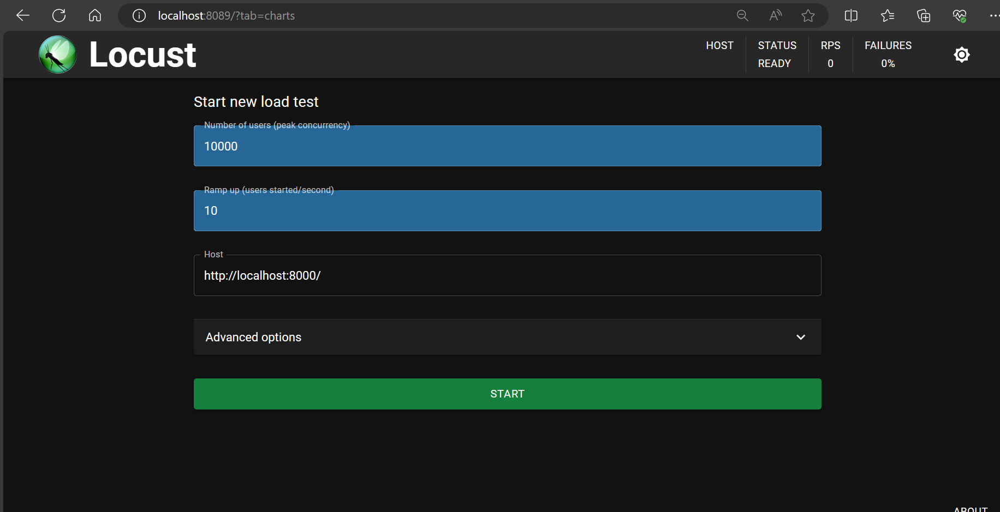
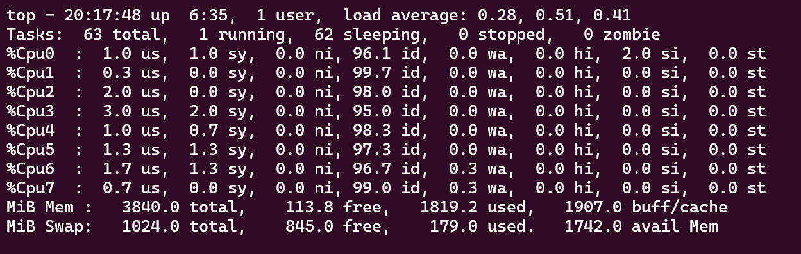
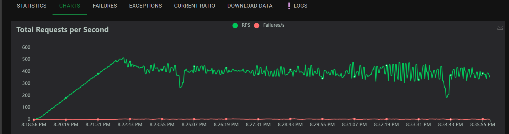
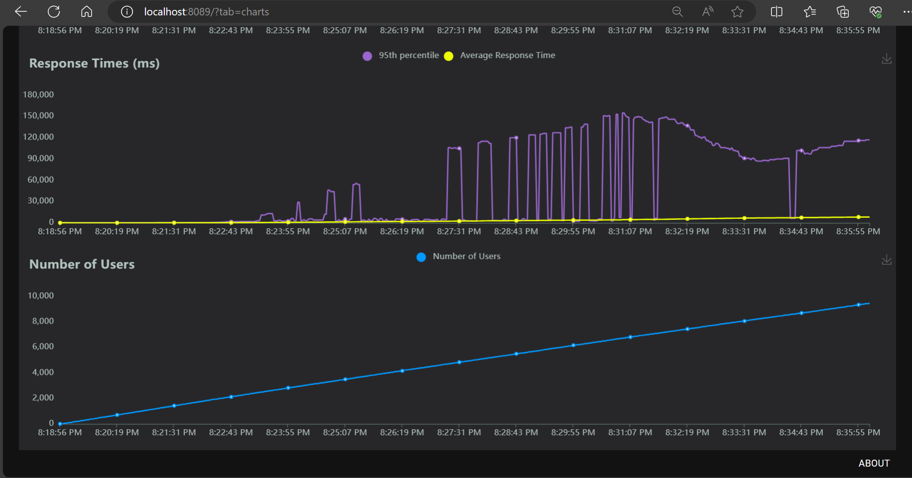

# Taller 4 - Grupo 1


Class: MLOps <br>
Code: 11179 <br>
Professor: Cristian Diaz Alvarez <br>
Members:

    Daniel Chavarro - @anielFchavarro
    Cristhian Palencia - @cpalenc
    Oscar Correa - @oecorrechag

## Table of Contents

- <a href='#1'>Local usage of Locust</a>
- <a href='#2'>Locust with Docker compose</a>
- <a href='#3'>Parts of Locust</a>
- <a href='#4'>Test with Locust</a>


### <a id='1'>Local usage of Locust </a>

1. Download the repository.

```bash
ssh git clone https://github.com/cpalenc/MLOps.git
```

2. Navigate to the Taller 4 branch within the project_1 folder.

```bash
cd MLOps/
git checkout taller_4
cd taller_4
```

3. To run the FastAPI App, execute the following command:

```bash
ssh python3 -m uvicorn main:app --reload
```

4. In another terminal, to run the tests using Locust, execute the following command:

```bash
ssh locust -f locustfile.py
```

### <a id='2'>Locust with Docker compose </a>


How to run docker compose

1. Download the repository.

```bash
ssh git clone https://github.com/cpalenc/MLOps.git
```

2. Navigate to the Taller 4 branch within the project_1 folder.

```bash
cd MLOps/
git checkout taller_4
cd taller_4
```

3. Run the following Docker command:

```bash
docker compose build
```
After

```bash
docker compose up
```

4. After executing the aforementioned commands in the console, you should gracefully transition to your preferred web browser and open both the Locust console and the FastAPI-based application.

For accessing the Locust console, please input:

```bash
http://localhost:8089/
```

For accessing the API console, please input:

```bash
http://localhost:8000/
```

### <a id='3'>Parts of Locust </a>


Upon accessing Locust, you will encounter the following:



1. Number of connections (users) to simulate
2. Rate of connections to add per second (the number will increase until reaching the total simulated connections).
3. The IP address of the FastAPI application to which you want to perform the connection test.

After entering the parameters, you will encounter a window similar to the following, with the parameters that will be explained below.



These are the most relevant parts of Locust.

- Statistics: Displays statistical data of the tests conducted.



- Failures: Indicates the percentage of samples with issues.



- Charts: Graphical representation of the tests performed (timings and connections).



- LOGS: Hardware information and some key execution points.

### <a id='4'>Test with Locust </a>

A maximum of 10,000 connections were simulated in increments of 10 on the API built in FastAPI, which took approximately 30 minutes. Variabilities such as PC usage or connections were not controlled.

A connection test, a GET request test, and a POST prediction test were added. We waited until the PC was at rest, approximately 100% idle.





Some images from the experiment execution.





Several CSV and HTML files resulting from the experiment:

- report.html
- requests.csv
- faulures.csv
- exceptions.csv

Conclusions: Although the experiment was executed only once, three points of interest were identified.

- Approximately 1200 connections (users) reach maximum response time, then stabilize at around 450 RPS.
- Around 3200 connections (users), response times begin to increase.
- Around 4700 connections (users), response times experience a further increase.

This suggests a threshold in the system's capacity. Around 1200 connections, there's a plateau in performance, followed by a decline near 3000 connections. where performance starts to degrade significantly under heavier loads.

<hr>

[Go to Top](#Table-of-Contents)